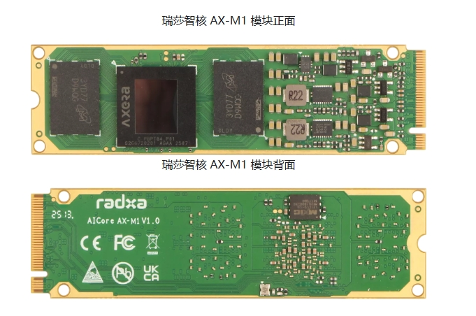
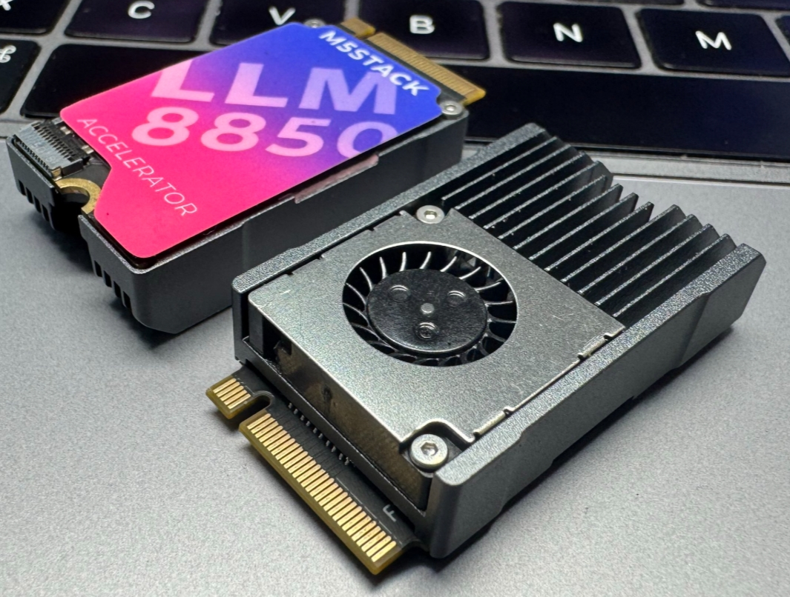

# Introduction

## Overview

AXCL is a C/Python API library for developing deep neural network inference, transcoding and other applications on [AXERA](https://www.axera-tech.com/) chip platforms. It provides APIs for runtime resource management, memory management, model loading and execution, and media data processing. The logical architecture is shown below:

## Concepts

The AXCL runtime library has basic concepts such as Device, Context, Stream, and Task. Their relationships are shown below:

- Device: A hardware device that provides computing and media processing capabilities, connected to the Host via PCIe interface.
  - The lifecycle of a Device begins with the first call to the `axclrtSetDevice` interface.
  - Device uses reference counting to manage its lifecycle. `axclrtSetDevice` increments the reference count by 1, and `axclrtResetDevice` decrements it by 1.
  - When the reference count reaches zero, the Device resources in this process become unavailable.
  - **Memory resources cannot be shared between multiple Devices**.
- Context: An execution context container that manages the lifecycle of Streams, memory, etc. Context is bound to an application thread. A Context always belongs to a unique Device. There are two types of Context:
  - Implicit Context (default Context):
    - When specifying a device via the `axclrtSetDevice` interface, the system creates an implicit Context. The implicit Context is automatically destroyed when the `axclrtResetDevice` reference count reaches zero.
    - A Device has only one implicit Context. The implicit Context cannot be destroyed via the `axclrtDestroyContext` interface.
  - Explicit Context:
    - Created explicitly via the `axclrtCreateContext` interface and destroyed via the `axclrtDestroyContext` interface.
    - Contexts within a process are shared and can be switched via `axclrtSetCurrentContext`. **It is recommended to create and destroy explicit Contexts for each thread**.
- Stream: A task execution stream that belongs to a Context. Tasks in the same Stream are executed in order. There are two types:
  - Implicit Stream (default Stream):
    - Each Context creates an implicit Stream whose lifecycle belongs to the Context.
    - Native SDK modules (e.g., `AXCL_VDEC_XXX`, `AXCL_SYS_XXX`, etc.) use the implicit Stream.
  - Explicit Stream:
    - Created by the `axclrtCreateStream` interface and destroyed by the `axclrtDestroyStream` interface.
    - When the Context that owns an explicit Stream is destroyed or its lifecycle ends, the Stream becomes unusable even if it has not been explicitly destroyed.
- Task: The Device task execution entity, invisible to applications.

## Application Threads and Context

- An application thread is always bound to a Context. All Device tasks must be based on a Context.
- A thread has exactly one current Context at any time. The Context binds the Device for task execution in this thread.
- Multiple Contexts can be created in a thread via `axclrtCreateContext`, but only one Context can be used at a time. When creating multiple Contexts consecutively, the thread binds to the last created Context.
- Within a process, `axclrtSetCurrentContext` can bind the current thread's Context. If called multiple times consecutively, the final binding is the last Context.
- For multi-threading, it is recommended to explicitly create one Context per thread.
- It is recommended to switch Devices via `axclrtSetCurrentContext`.

:::{tip}

   The SDK axcl/sample/runtime provides example code on how to create and destroy Contexts in threads.

:::

## Reference Hardware

### AX-M1

[Radxa AI Core AX-M1](https://docs.radxa.com/aicore/ax-m1) is a high-performance M.2 accelerator module based on AXERA's AX8850 SoC, featuring high computing power and high energy efficiency, designed for edge intelligent computing and AI inference applications. It integrates multi-core high-performance CPU and high-computing-power NPU, with excellent multimedia processing capabilities, providing efficient and flexible hardware support for various edge AI scenarios.

**Product Image**

**Specifications**

|              | Description                                                    |
| ------------ | -------------------------------------------------------------- |
| CPU          | Octa-core Cortex-A55, up to 1.5GHz                            |
| Memory       | 8GB LPDDR4x                                                   |
| NPU          | 24TOPS@INT8; supports matrix computing unit and intelligent vision engine |
|              | Supports CNN, Transformer model deployment, supports LLM, VLM deployment |
| VPU          | Supports H.264/H.265 8K@30fps encoding/decoding and 16-channel 1080p@30fps decoding |
| HW Support   | Supports Intel, AMD, Rockchip and other host platforms         |
| OS Support   | Supports Ubuntu, Debian, CentOS and other mainstream Linux distributions |
| Form Factor  | M.2 2280, M Key                                               |
| Voltage      | 3.3 V                                                         |
| Power        | ≤ 8W                                                          |

### LLM-8850

[M5Stack LLM-8850 Card](https://docs.m5stack.com/zh_CN/guide/ai_accelerator/overview) is an M.2 M-Key 2242 AI accelerator card from M5Stack designed for edge devices.

**Product Image**

**Specifications**

|              | Description                                                    |
| ------------ | -------------------------------------------------------------- |
| CPU          | Octa-core Cortex-A55, up to 1.5GHz                            |
| Memory       | 8GB LPDDR4x                                                   |
| NPU          | 24TOPS@INT8; supports matrix computing unit and intelligent vision engine |
|              | Supports CNN, Transformer model deployment, supports LLM, VLM deployment |
| VPU          | Supports H.264/H.265 8K@30fps encoding/decoding and 16-channel 1080p@30fps decoding |
| HW Support   | Supports Intel, AMD, Rockchip and other host platforms         |
| OS Support   | Supports Ubuntu, Debian, CentOS and other mainstream Linux distributions |
| Form Factor  | M.2 2242, M Key                                               |
| Voltage      | 3.3 V                                                         |
| Power        | ≤ 8W                                                          |